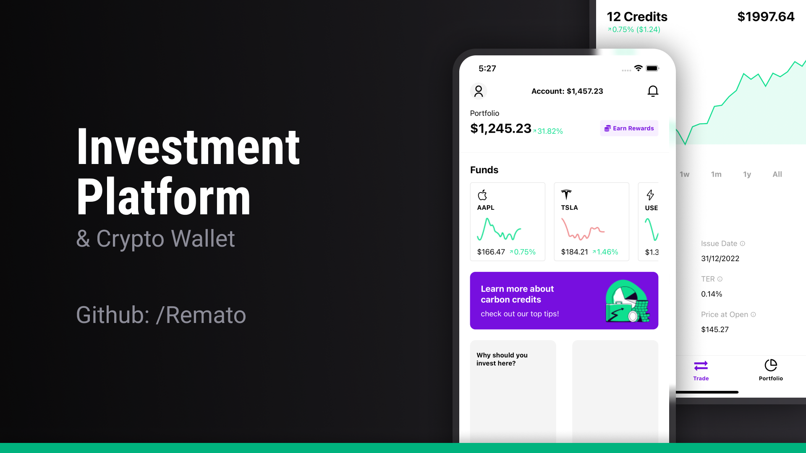

<h1 align="center"> Investment Platform </h1>

<p align="center">This project is being created with <b>React Native</b>, <b>Zustand</b>, <b>Typescript</b> and <b>React Chart Kit</b><br/>


<p align="center">
  <a href="#-technologies">Technologies</a>&nbsp;&nbsp;&nbsp;|&nbsp;&nbsp;&nbsp;
  <a href="#-project">Project</a>&nbsp;&nbsp;&nbsp;|&nbsp;&nbsp;&nbsp;
  <a href="#-execution">Execution</a>&nbsp;&nbsp;&nbsp;|&nbsp;&nbsp;&nbsp;
  <a href="#-demo">Demo</a>&nbsp;&nbsp;&nbsp;&nbsp;&nbsp;&nbsp;

</p>

<br>

<p align="center">
  
</p>

## 🚀 Technologies

This project was developed using the following technologies and standards:

- [React Native](https://reactnative.dev/)
- [Typescript](https://www.typescriptlang.org/)
- [Formik](https://github.com/jaredpalmer/formik)
- [Zustand](https://github.com/pmndrs/zustand)
- [Styled Components](https://styled-components.com/)
- [React Chart Kit](https://github.com/indiespirit/react-native-chart-kit)

## 💻 Project

This was an application created to study and manipulate graphics within React Native

## ⚙️ Execution

Install dependencies and run via Expo Go
```sh
yarn && yarn dev
```

    [1] Create a User - Signup page
    [2] Login - to access mocked resources.

## 🖥 Demo

You  can see a preview here


---